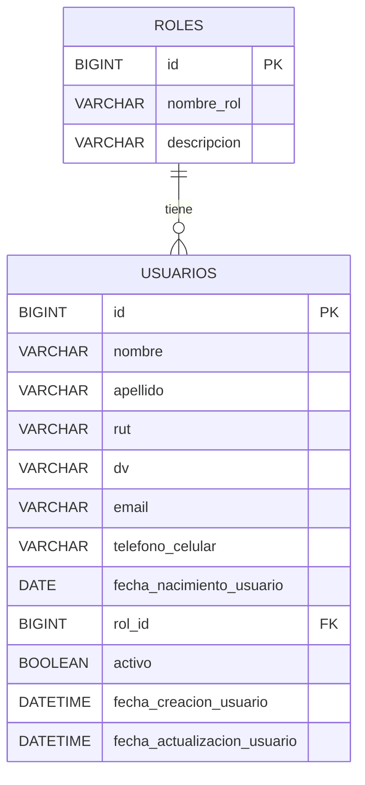

# 👤 Users Microservice (usuarios-api v1)

## Descripción

Microservicio encargado de la **gestión de usuarios** dentro del ecosistema de VetDistribuidora SPA. Permite registrar usuarios, consultar por ID o por múltiples IDs, listar todos, actualizar y eliminar, asociándolos a un rol correspondiente.

Este microservicio forma parte de una arquitectura distribuida para la transformación digital de VetDistribuidora SPA.

## Tech Stack

### Infraestructura:

- [Java 25 LTS](https://docs.oracle.com/en/java/javase/25/): Última versión Java
  Long Term Support.
- [Spring Boot v4.0.6](https://github.com/spring-projects/spring-boot): Última
  versión estable.
- [Docker](https://docs.docker.com/) &
  [Docker Compose](https://docs.docker.com/compose/): Contenedorización y
  entorno de desarrollo.
- [MySQL v8.4 LTS](https://hub.docker.com/_/mysql): Base de datos relacional.

### Dependencias:

1. **Lombok:** Reducción de boilerplate (getters, setters, constructores)
2. **Validation:** Validación de beans con Jakarta
3. **Spring Boot DevTools:** Autoreload y mejoras de desarrollo
4. **Spring WebMVC:** Capacidades REST para controladores MVC
5. **Spring WebFlux:** WebClient para comunicación inter-microservicios
6. **Spring Data JPA:** ORM para manejo de entidades
7. **MySQL Connector:** Driver de conexión a la base de datos
8. **Flyway Migration:** Migraciones versionadas de base de datos
9. **Spotless (Palantir):** Autoformateador de código
10. **SpringDoc OpenAPI (Swagger):** Documentación interactiva de la API

## 📊 Modelo de Datos

### Diagrama Entidad-Relación



### Entidades

| Entidad   | Tabla      | Descripción                                                |
| --------- | ---------- | ---------------------------------------------------------- |
| `Rol`     | `roles`    | Catálogo de roles del sistema (Admin, Cliente, Vet, etc.)  |
| `Usuario` | `usuarios` | Registro de usuarios con datos personales y rol asignado   |

## Estructura del Proyecto

```
src/main/java/cl/duoc/usuarios_api/
├── UsuariosApiApplication.java        # Clase principal
├── controller/
│   └── UsuarioController.java         # Endpoints REST
├── dto/
│   ├── request/
│   │   └── UsuarioRequestDto.java     # DTO de entrada
│   └── response/
│       ├── UsuarioResponseDto.java    # DTO de salida principal
│       └── RolResponseDto.java        # DTO anidado de rol
├── model/
│   ├── Usuario.java                   # Entidad JPA
│   └── Rol.java                       # Entidad JPA
├── repository/
│   ├── UsuarioRepository.java
│   └── RolRepository.java
└── service/
    └── UsuarioService.java            # Lógica de negocio y mapeo DTO
```

## 🔗 API / Endpoints

Base URL: `/api/v1/usuarios`

| Acción                  | Método | Endpoint                            | Estado   |
| ----------------------- | ------ | ----------------------------------- | -------- |
| Registrar usuario       | POST   | `/api/v1/usuarios`                  | ✅ Listo |
| Consultar por ID        | GET    | `/api/v1/usuarios/{id}`             | ✅ Listo |
| Consultar por múlt. IDs | GET    | `/api/v1/usuarios/buscar-por-ids`   | ✅ Listo |
| Listar todos            | GET    | `/api/v1/usuarios`                  | ✅ Listo |
| Actualizar usuario      | PUT    | `/api/v1/usuarios/{id}`             | ✅ Listo |
| Eliminar por ID         | DELETE | `/api/v1/usuarios/{id}`             | ✅ Listo |
| Eliminar por múlt. IDs  | DELETE | `/api/v1/usuarios/eliminar-por-ids` | ✅ Listo |
| Eliminar todos          | DELETE | `/api/v1/usuarios`                  | ✅ Listo |

### Ejemplo de Request (POST `/api/v1/usuarios`)

```json
{
  "nombre": "Rodrigo",
  "apellido": "Callealta",
  "rut": "12345678",
  "dv": "9",
  "email": "rodrigo@email.com",
  "telefonoCelular": "+56912345678",
  "fechaNacimiento": "1995-03-20",
  "rol": 1,
  "activo": true
}
```

### Ejemplo de Response

```json
{
  "id": 1,
  "nombreCompleto": "Rodrigo Callealta",
  "rut": "12345678-9",
  "email": "rodrigo@email.com",
  "edad": 31,
  "telefonoCelular": "+56912345678",
  "rol": {
    "id": 1,
    "nombreRol": "Cliente",
    "descripcion": "Usuario cliente del sistema"
  },
  "activo": true
}
```

> [!NOTE]
> El response combina `nombre` + `apellido` en `nombreCompleto`, calcula la
> `edad` a partir de `fechaNacimiento`, y concatena `rut` + `dv` con guion.
> Esta transformación se realiza en el Service (mapeo DTO).

## 📁 Migraciones Flyway

Las migraciones se encuentran en `src/main/resources/db/migration/`:

| Archivo | Descripción |
| ------- | ----------- |
| 🚧 WIP  | Pendiente   |

> [!IMPORTANT]
> Las migraciones Flyway aún no han sido creadas. Actualmente la carpeta
> `db/migration/` está vacía.

## Entorno de Desarrollo

### 1. Configurar variables de entorno

Crear un archivo `.env` a partir del ejemplo proporcionado:

```bash
cp .env.example .env
```

Variables principales del `.env`:

```yaml
SPRING_ENV=dev
SPRING_APP_NAME=UsersMicroservice
HOST_PORT=8081
HOST_DB_PORT=3307
MYSQL_DATABASE=users
MYSQL_HOST=localhost
MYSQL_USER=user
MYSQL_PASSWORD=password
MYSQL_ROOT_PASSWORD=root_password
PHPMYADMIN_PORT=8089
```

> [!WARNING]
> Asegúrate de usar puertos diferentes a los de los otros microservicios
> (api-mascotas usa 8082/3306/8088, vets-api usa sus propios puertos).

### 2. Levantar la base de datos

```bash
docker compose up -d
```

### 3. Verificar BD vía phpMyAdmin

- Ir a [http://localhost:8089](http://localhost:8089)
- Usar las credenciales definidas en `.env`. Por defecto:
  - **User:** `user`
  - **Password:** `password`

### 4. Ejecutar la aplicación

```bash
./mvnw spring-boot:run
```

La API estará disponible en `http://localhost:8081/api/v1/usuarios`

### 5. Documentación Swagger

Una vez levantada la aplicación, acceder a:

- **Swagger UI:** [http://localhost:8081/swagger-ui.html](http://localhost:8081/swagger-ui.html)
- **OpenAPI JSON:** [http://localhost:8081/v3/api-docs](http://localhost:8081/v3/api-docs)

### Perfiles de configuración

| Perfil     | Archivo                           | Uso                          |
| ---------- | --------------------------------- | ---------------------------- |
| `dev`      | `application-dev.properties`      | Desarrollo local con Docker  |
| `devlocal` | `application-devlocal.properties` | Desarrollo local alternativo |
| `prod`     | `application-prod.properties`     | Producción                   |
| `test`     | `application-test.properties`     | Testing                      |

## 🔀 Git & Workflow

- **Branch `dev`:** Todo el desarrollo va aquí.
- **Branch `main`:** Solo código listo para producción.
- Commits siguen
  [Conventional Commits](https://www.conventionalcommits.org/en/v1.0.0/):

  ```
  feat(UsuarioService): add user registration logic
  fix(UsuarioController): handle null rol validation
  ```

## 👥 Equipo

- Eduardo Bray
- Rodrigo Callealta
- Fernando Villalobos

## 🛠 Microservicio Desarrollado Por Rodrigo Callealta

- user github = lironscallealta

> **DuocUC — FullStack 1 © 2026**

---
