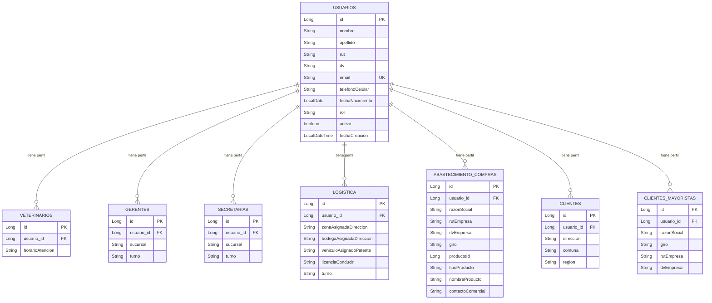

# Diagrama ER - Usuarios API

```mermaid
erDiagram
    USUARIOS {
        Long id PK
        String nombre
        String apellido
        String rut
        String dv
        String email UK
        String telefonoCelular
        LocalDate fechaNacimiento
        String rol
        boolean activo
        LocalDateTime fechaCreacion
    }

    VETERINARIOS {
        Long id PK
        Long usuario_id FK
        String horarioAtencion
    }

    GERENTES {
        Long id PK
        Long usuario_id FK
        String sucursal
        String turno
    }

    SECRETARIAS {
        Long id PK
        Long usuario_id FK
        String sucursal
        String turno
    }

    LOGISTICA {
        Long id PK
        Long usuario_id FK
        String zonaAsignadaDireccion
        String bodegaAsignadaDireccion
        String vehiculoAsignadoPatente
        String licenciaConducir
        String turno
    }

    ABASTECIMIENTO_COMPRAS {
        Long id PK
        Long usuario_id FK
        String razonSocial
        String rutEmpresa
        String dvEmpresa
        String giro
        Long productoId
        String tipoProducto
        String nombreProducto
        String contactoComercial
    }

    CLIENTES {
        Long id PK
        Long usuario_id FK
        String direccion
        String comuna
        String region
    }

    CLIENTES_MAYORISTAS {
        Long id PK
        Long usuario_id FK
        String razonSocial
        String giro
        String rutEmpresa
        String dvEmpresa
    }

    USUARIOS ||--o{ VETERINARIOS : "tiene perfil"
    USUARIOS ||--o{ GERENTES : "tiene perfil"
    USUARIOS ||--o{ SECRETARIAS : "tiene perfil"
    USUARIOS ||--o{ LOGISTICA : "tiene perfil"
    USUARIOS ||--o{ ABASTECIMIENTO_COMPRAS : "tiene perfil"
    USUARIOS ||--o{ CLIENTES : "tiene perfil"
    USUARIOS ||--o{ CLIENTES_MAYORISTAS : "tiene perfil"
```
