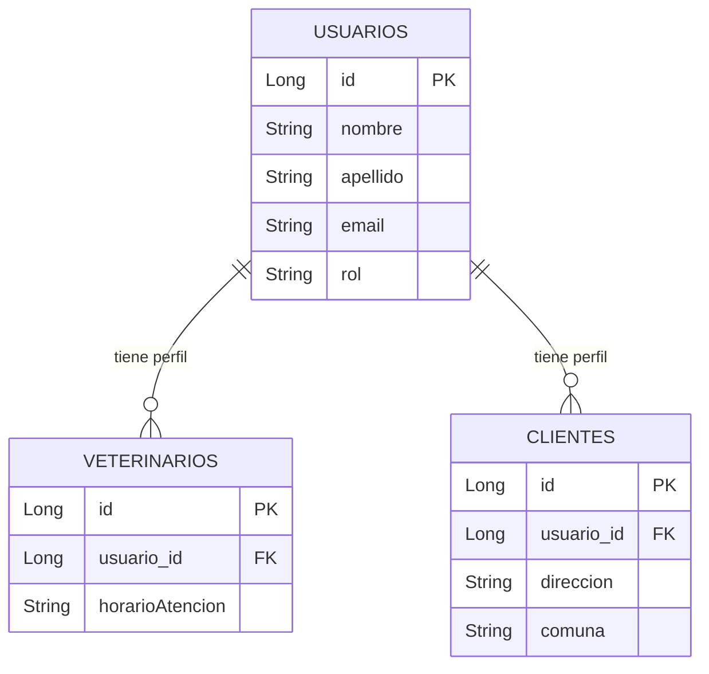

# Diagrama de Base de Datos - Usuarios API

Este diagrama se genera automáticamente con Mermaid.
Solo es texto, pero GitHub y VS Code lo muestran como gráfico.

## ¿Cómo funciona?

Todo lo de arriba es **texto plano**. Las reglas son:

1. Abres con triple backtick + la palabra `mermaid`
2. Escribes `erDiagram` para indicar que es un diagrama ER
3. Defines tablas con `NOMBRE_TABLA { tipo campo }`
4. Marcas claves con `PK` (Primary Key) o `FK` (Foreign Key)
5. Defines relaciones con flechas: `TABLA1 ||--o{ TABLA2 : "descripción"`
6. Cierras con triple backtick

### Tipos de relaciones:
- `||--||` = uno a uno
- `||--o{` = uno a muchos
- `o{--o{` = muchos a muchos
